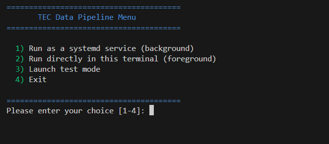
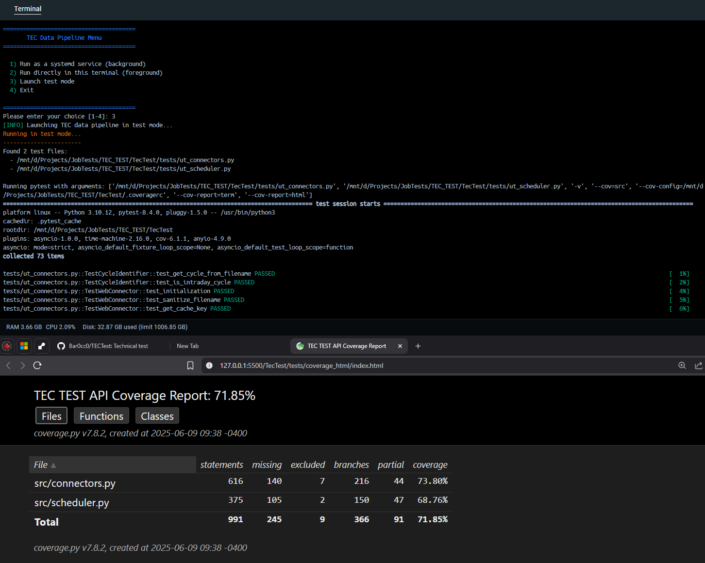
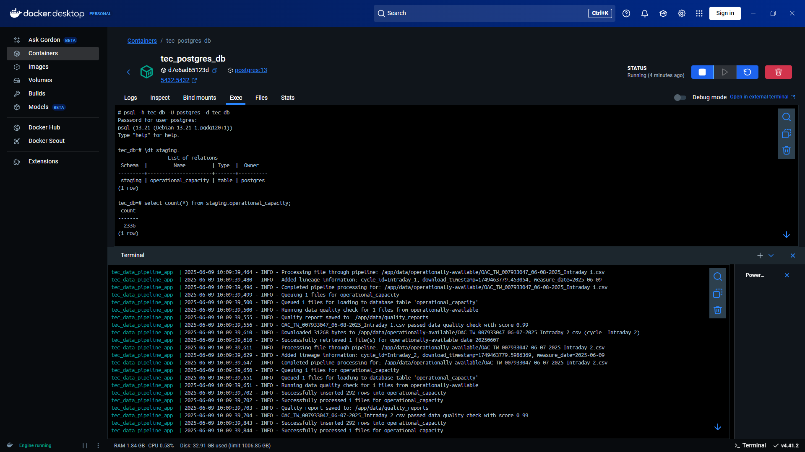
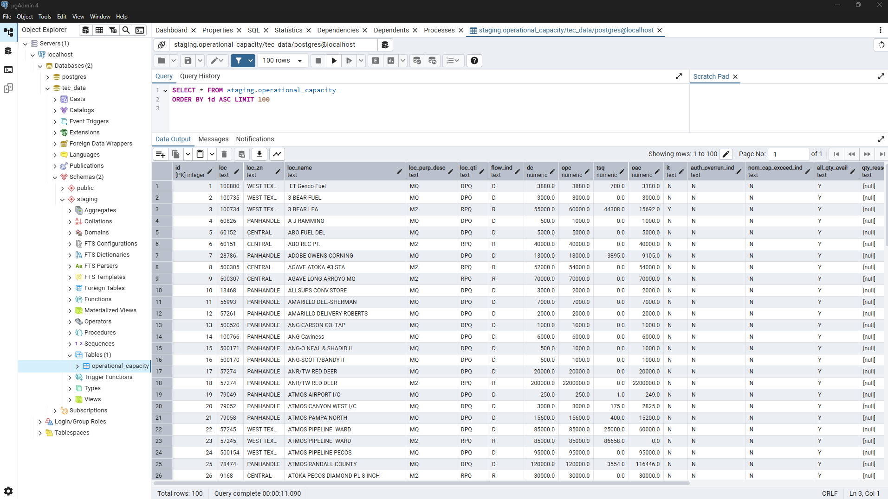
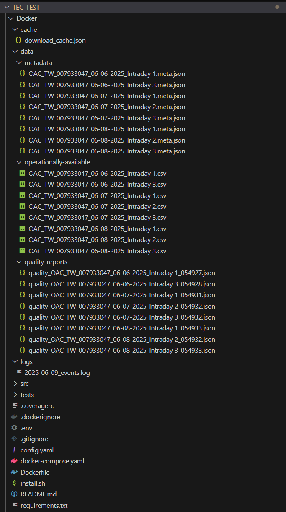

# TEC_TEST Data Pipeline

[1. Information](#information)  
[2. Overview](#overview)  
[3. Installation](#installation)  
[4. Running the Application](#running-the-application)  
[5. Configuration](#configuration)  
[6. Test Suite](#test-suite)  
[7. Database Tables](#database-tables)  
[8. Monitoring](#monitoring)

## Information
**Energy Transfer Capacity Data Pipeline**
- Application Name: TEC Data Pipeline v1.0.0
- Configuration: `config.yaml`, `.env` (for Docker)
- Main Script: `src/main.py`

## Overview

- This app is a Python-based system designed to download and process CSV files from Energy Transfer, and store the data into a PostgreSQL database. 
- Once started, the system continuously checks for new data cycles and processes them as they become available. 
- Target is TW's operational capacity but the system can easily support additional data sources (via `config.yaml`).
- It supports containerized deployment using Docker and systemd for process management.


## Installation
### Prerequisites
- Python 3.10+ 
- PostgreSQL, PGAdmin (optional)
- Docker, Docker Desktop (optional)
- Anaconda (optional)

### Clone the Repository
```bash
git clone https://github.com/Bar0cc0/TECTest.git
cd TecTest
```
### Create a Virtual Environment (recommended)
```bash
python3 -m venv .venv 		# Or use Anaconda: conda create -n tecEnv python=3.10
source .venv/bin/activate  	#                  conda activate tecEnv
```
### Install Dependencies
```bash
pip install -r requirements.txt
```

## Running the Application

### Method 1: Docker Deployment (recommended)

#### Building and Starting Services
```bash
# Build all services
docker-compose build

# Start services
docker-compose up

# Stop services (and delete database data by removing volumes)
docker-compose down -v

```


### Method 2: Direct CLI Usage (local, for development or testing)
### Syntax

```bash
python src/main.py [--params key=value [key=value ...]] [--loglevel LEVEL] [--test]
```

### Examples

```bash
# Fetch data for default asset/endpoint (defined in config.yaml)
python src/main.py

# Fetch specific cycle for default asset/endpoint
python src/main.py --params cycle=1

# Enable Debug Logging
python src/main.py --loglevel DEBUG

# Run the Test Suite
python src/main.py --test

# NOTE: On WSL, you might encounter permission issues
```


### Method 3: Interactive mode (local, for development or testing)
```bash
bash install.sh
```


## Configuration

The system is configurable via a YAML file (`config.yaml`).  

However, in production (e.g., Docker), environment variables (`.env`) will have precedence over `config.yaml` settings to ensure sensitive information is not exposed.

## Test Suite

1. **Test Coverage**
   - Unit tests cover key components:
	 - Connectors
	 - Scheduler

2. **Reports**
   - Pytest logs are displayed in the terminal.
   - HTML coverarge report available at `tests/coverage_html/index.html` (running a local server is required to view in browser)




## Database Tables
Schema structure is defined in `src/staging_schema.sql`.  

## Monitoring
### Docker Desktop
Logs, container status and database management can be easily monitored using Docker Desktop: 


### PGAdmin
The database tables can be viewed using PGAdmin or any PostgreSQL client:  


### Project Assets
